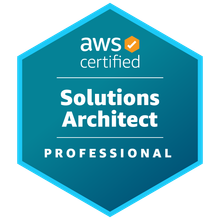

# README

The objective of this repository is to share my learning notes during my preparation for:

- AWS Certified Solutions Architect - Associate.
- AWS Certified Developer - Associate.
- AWS Certified Solutions Architect - Professional.

This repository is target for people that are planning to start using AWS (Amazon Web Services) or willing to pursue the certification path.

Feel free to fork this repository and contribute to it.

Please note that this repo is under construction and will be update as part of my learning path with Amazon Web Service journey.

|  |  |  |
| ---------------------------------------------------------- | ------------------------------------------------------------ | ---------------------------------------------------------- |

# Table of Content

